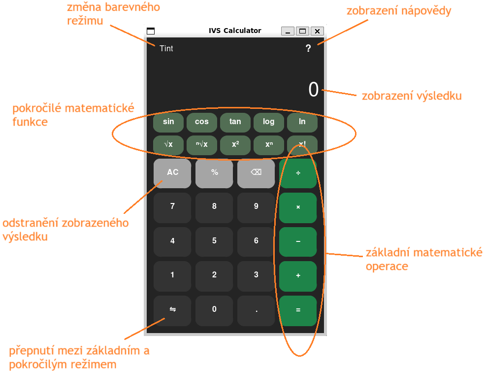

# Portfolio team projects
Here is a list of interesting projects that I worked on in a team and are publically available but not on my own github.

## Evenmate
Group expense splitter app (similar to Settle up or Splitwise)  
Created with one other collegue as a school project using **React Native** with **Expo**.  
Link to project repo: [https://github.com/EightL/Evenmate-expense-splitter-app]  

Showcase of the app:

## Zig-like language translator
This program checks lexical structure, syntax and semantics of input Zig-like source code and outputs it's translation to custom three-address instructions.  
Created in a group of 4. While I worked mostly on semantics check and code generation.  
Whole project is made in **C**.

Link to project repo: [https://github.com/jakub-34/Zig_translator]

## Tool for visual editing and runtime monitoring of interpreted finite state machines
As well created with one other collegue as school project. This time in **C++** using **Qt**.  
Allows to visually create, edit and interpret finite state machines that can run JS code snippets as transition conditions or on enter actions for individual states. Also allows to define multiple variables and inputs that can be then used in the JS code.

Link to project repo: [https://github.com/EightL/fsm-automata-editor-monitor]  

Showcase of the app:

-------------------------------------------------------------------------------------------------
Following projects may not be made public yet because the final evaluation of the projects isnt't done or the owner of the repository decided not to.

## Website for managing student tournaments and competitions
Created with one other collegue. Server-side is made in PHP. Uses SQL database for storing data about users/tournaments/groups etc. Allows users to create tournaments, groups to join the tournaments with, enter results for matches, view information about other users and groups, admin access and many more functions.

Link to the deployed website: [https://www.stud.fit.vutbr.cz/~xlucnyj00]  
Link to project repo: [https://github.com/EightL/iis-project]  

Showcase of the website:

## Simple calculator
Created in a group of 4 people. The project wasn't mainly focused on the final product but mostly on the process of creating it, that means: work in group, planning, teamwork, documentation, Makefile and overall cooperation in a team.  
For the programming part I worked mostly on expession evaluator and integrating all the created parts together (GUI + math libary) as well as polishing any potential bugs and missing details.  
The project is build in **Python**.  

Link to project repo: [https://github.com/konarm/Utopisti_IVS]  

Showcase of the app:

